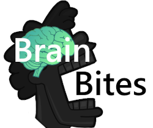

# Brain Bites

 
Shorten long documentaries 📽️ into short, education-packed videos ⚡.
 

## Usage / Running

To run the project, you will need the `openai` and `dotenv` Python libraries. 
You can either `pip install` them, or can install them otherwise appropriate to your operating system. 
 
You will also need `yt-dlp`, `ffplay` and `ffmpeg` available on your system's PATH, so it is executable from the terminal. 
 
The project will require an environment variable keystore (`.env` file) with the following keys:

- `OPENAI_KEY` - Your OpenAI API key.
- `RUNTIME_DIR` (optional) - The runtime directory, defaults to `./runtime`

 

## The Vision

The current project trajectory is to use AI and LLM to trim YouTube videos from lengthy documentaries into short and fast paced educational videos. 
This is to make videos more engaging and practical for usage, such as in a classroom, where time and attention spans are limited. 

The content is implemented in a frontend, scrolling-style web application.

 

## The Process

- We feed **OpenAI's GPT-4** with YouTube transcripts, asking the LLM to regenerate chapterized, concise transcript. 
- A comparison between the full and trimmed transcript will occur using a custom text-comparison algorithm, finding the removed sentences from the transcript. 
- The video will be split into chapters based on the shortened transcript using **ffmpeg**. 
- A quiz and chapter summaries are also generated to aid with learning, again using **OpenAI's GPT-4**.
- The content generated is served on-demand by the frontend

 

## Inversity

This is an [Inversity](https://inversity.co/) project application. 
We were tasked with "How can AI make education more engaging, effective and equitable?"
